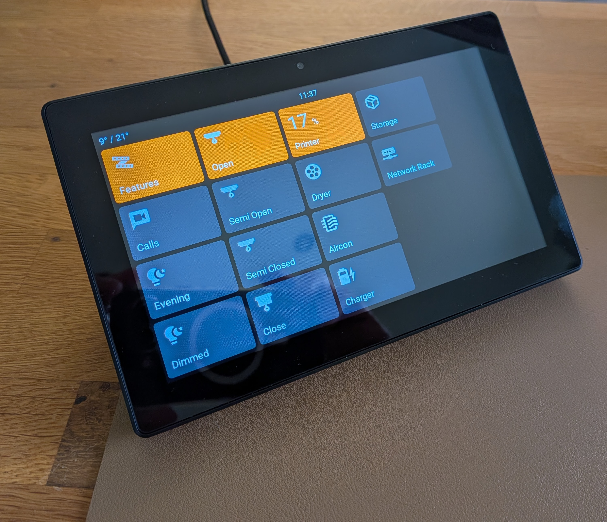
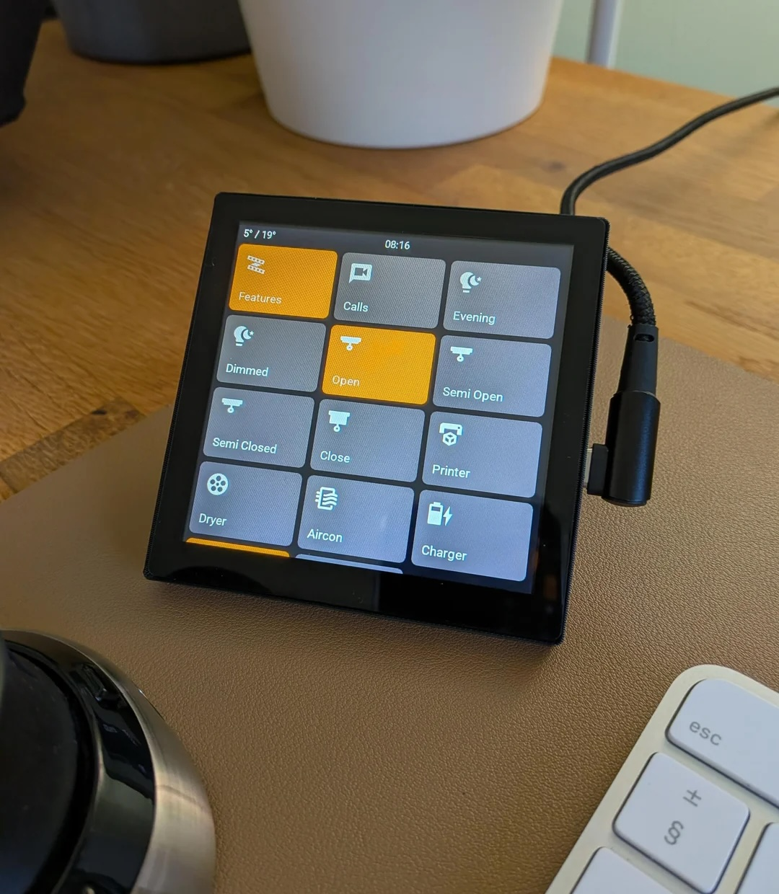
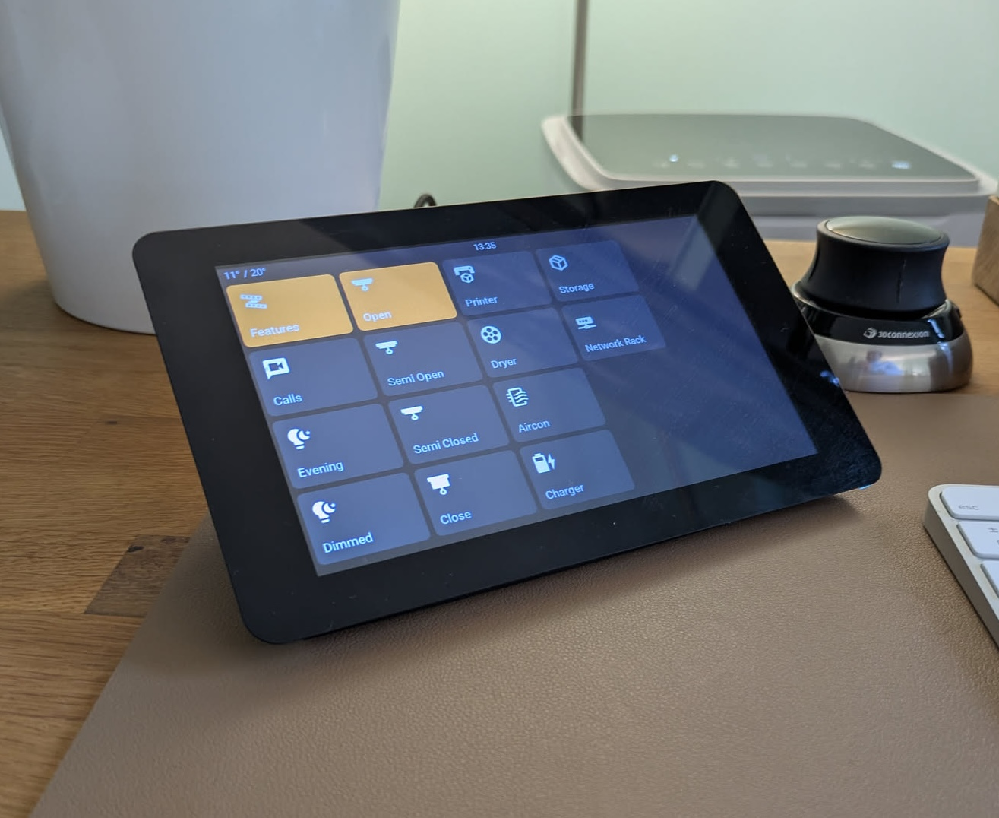

# ESPHome LVGL Configuration Repository

Welcome to my ESPHome LVGL configuration repository! This project provides a modular setup for ESP32 touch LCD devices using the LVGL graphics library, designed specifically for home automation and sensor monitoring.

*7-inch touch LCD display running ESPHome with LVGL interface, showing home automation controls including temperature display, printer status, air conditioning controls, and various smart home features.*

## Purpose

This repository contains ESPHome configurations for creating beautiful, touch-enabled displays for home automation. The setup is organized into modular components that can be mixed and matched to create custom interfaces for different rooms and use cases.

## Features

- **ESP32 Touch LCD Support**: Optimized for multiple ESP32-based touch LCD displays
- **Modular Design**: Organized components for easy customization
- **LVGL Interface**: Modern, responsive touch interface
- **Sensor Integration**: Built-in support for various sensors
- **Custom Themes**: Styled buttons and UI components
- **Network & Time**: Automatic network connectivity and time synchronization
- **Backlight Control**: Intelligent display brightness management

## Supported Devices

**[Guition ESP32-P4 JC1060P470](guition-esp32-p4-jc1060p470/README.md)** (7", ~£40)



**[Guition ESP32-S3 4848S040](guition-esp32-s3-4848s040/README.md)** (4.0", ~£16)



**[Waveshare ESP32-S3 Touch LCD 7"](waveshare-esp32-s3-touch-lcd-7/README.md)** (~£40)



## Where to Buy

| Device | Configuration | Where to Buy |
|--------|---------------|--------------|
| Guition ESP32-P4 JC1060P470 (7") | [esphome.yaml](guition-esp32-p4-jc1060p470/esphome.yaml) | [AliExpress](https://s.click.aliexpress.com/e/_c335W0r5) |
| Guition ESP32-S3 4848S040 (4.0") | [esphome.yaml](guition-esp32-s3-4848s040/esphome.yaml) | [AliExpress](https://s.click.aliexpress.com/e/_c3sIhvBv) |
| Waveshare ESP32-S3 Touch LCD 7" | [esphome.yaml](waveshare-esp32-s3-touch-lcd-7/esphome.yaml) | [AliExpress](https://s.click.aliexpress.com/e/_c37ljk8J) |

## Stands

Desk/desktop stands (3D printable models on MakerWorld):

| Device | Stand |
|--------|-------|
| Guition ESP32-P4 JC1060P470 (7") | [Link](https://makerworld.com/en/models/2387421-guition-esp32p4-jc1060p470-7inch-screen-desk-mount#profileId-2614995) |
| Guition ESP32-S3 4848S040 (4.0") | [Link](https://makerworld.com/en/models/2327976-touch-screen-desktop-stand-for-guition-4848s040#profileId-2543111) |
| Waveshare ESP32-S3 Touch LCD 7" | [Link](https://makerworld.com/en/models/1009516-desk-stand-for-7inch-waveshare-touch-screen#profileId-2439605) |

## How to get it working

Follow these steps in order. The first flash is the only fiddly part; after that you can usually update over WiFi (OTA).

1. **Fork this repo** (recommended) and clone it. The configs are meant to be customized for your own setup rather than used as-is.

2. **Install ESPHome**  
   Use the [ESPHome installation guide](https://esphome.io/guides/installing_esphome.html). Run the ESPHome dashboard (e.g. `esphome dashboard` or your usual method) and open it in **Chrome** — you’ll need Chrome for USB flashing later.

3. **Add your device config**  
   For your panel, open the `esphome.yaml` in that device's folder (see the table above). **Use the full contents of that file as your ESPHome config**: in the dashboard, create a new device (or edit an existing one) and paste in the template contents.

4. **Set WiFi and secrets**  
   In the ESPHome dashboard, open **Secrets** (top right) and add at least:
   ```yaml
   wifi_ssid: "Your_WiFi_SSID"
   wifi_password: "Your_WiFi_Password"
   ```

5. **First flash over USB**  
   Connect the board with a **USB cable**. In the dashboard, compile and choose **Install** (flash). Pick the serial port when asked.  
   - If the board isn’t found, install the USB drivers (CP210x, CH340, etc.) — ESPHome will prompt you and give links.  
   - If the board has factory demo firmware and the flash fails, put it in **flashing mode** once: hold **boot**, press **reset**, then try flashing again. You usually only need to do this once.
   - Disconnect the USB and reconnect it to power each time you flash over USB. This isn't required for updates over WiFi.

6. **Done**  
   After a successful flash, the device should appear in the ESPHome dashboard and in Home Assistant as a discovered device. Later you can update it over WiFi (OTA) from the dashboard.

7. **Allow Home Assistant actions**  
   For the screen to be able to control things in Home Assistant (e.g. toggle lights, activate scenes), you need to enable this per-device. In Home Assistant go to **Settings → Devices & Services → ESPHome**, click **Configure** on your device, and turn on **"Allow the device to perform Home Assistant actions"**. Without this, any `homeassistant.action` calls from the display will be silently ignored.

**Optional:** To change what’s on the display, edit the YAML in the device folder: `device/device.yaml`, `device/sensors.yaml`, `device/lvgl.yaml`, plus `addon/`, `assets/`, and `theme/` as needed.

## Resources

- [ESPHome LVGL documentation](https://esphome.io/components/lvgl/index.html)
- [Getting started with ESPHome](https://esphome.io/guides/getting_started_hassio/)
- [LVGL hints and tips](https://esphome.io/cookbook/lvgl/)
- [Setup guide video](https://www.youtube.com/watch?v=AAMMob9f-mk&t=857s)
- [LVGL-specific install video](https://www.youtube.com/watch?v=8TuYq-6c5ok)

## Home Assistant Stateful Scenes

The lighting scene examples in this project assume you are using the Stateful Scenes integration for Home Assistant so scene state can be inferred reliably (for example, keeping a scene switch "on" when all scene entities match). Install and configure the add-on here: https://github.com/hugobloem/stateful_scenes.

---

**Remember**: This repository contains my personal home automation setup. Please fork and customize it for your own environment.
